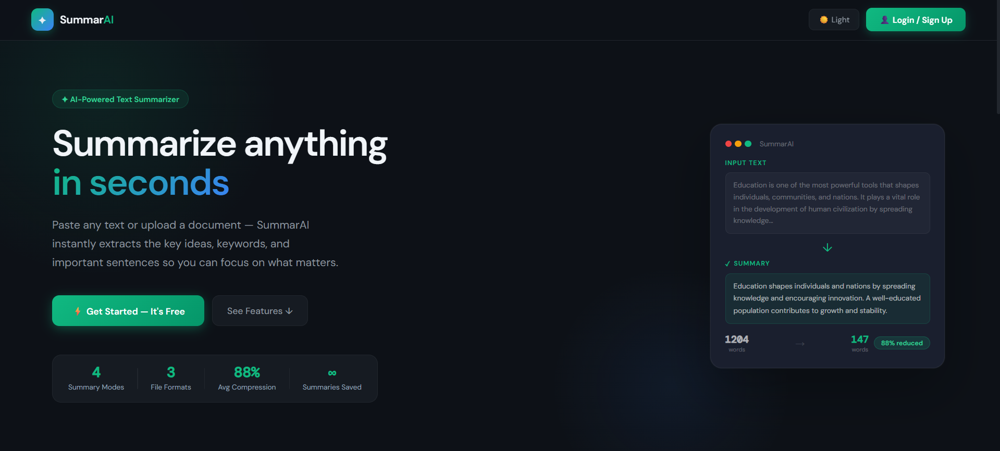
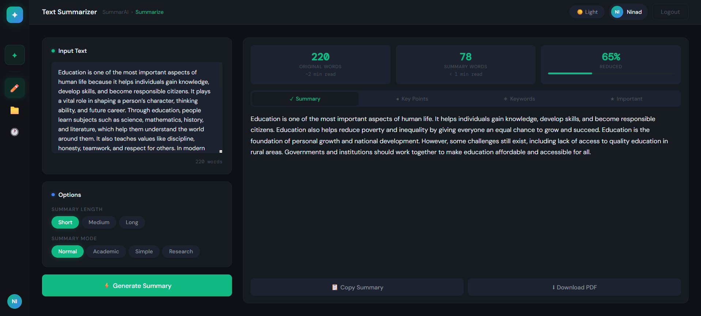

# SummarAI — AI Text Summarizer

A full-stack AI-powered text summarizer built with React + FastAPI + Facebook BART.




## Features
- 🏠 Landing page with feature showcase
- 🔐 Login / Register modal popup
- ⚡ AI-powered summaries using Facebook BART
- 📄 Upload PDF, DOCX, or TXT files with drag & drop
- 🎯 4 summary modes — Normal, Academic, Simple, Research
- 📏 3 summary lengths — Short, Medium, Long
- 🔑 Keyword extraction with click-to-highlight in summary
- 📋 Key points and important sentences extraction
- 📊 Reading time estimates and compression ratio bar
- 🌀 Skeleton loading animation
- 🕐 Summary history with search and favorites
- 📌 Recent summaries in collapsible sidebar
- 🌙 Dark / Light mode
- 📥 Export summary as PDF

## Tech Stack
- **Frontend**: React 19, CSS
- **Backend**: FastAPI, SQLite, Python
- **AI Model**: Facebook BART (facebook/bart-large-cnn)
- **Auth**: JWT + bcrypt
- **PDF**: PyPDF2, jsPDF
- **Keywords**: YAKE

## Project Structure
Text-Summarizer/
├── backend/
│   ├── app/
│   │   ├── routes/summarize.py
│   │   ├── services/summarizer.py
│   │   ├── models/request_models.py
│   │   ├── auth.py
│   │   ├── database.py
│   │   └── main.py
│   ├── requirements.txt
│   └── run.py
└── frontend/
├── src/
│   ├── components/
│   │   ├── InputPanel.js
│   │   ├── OptionsPanel.js
│   │   └── ResultPanel.js
│   ├── HomePage.js
│   ├── HomePage.css
│   ├── App.js
│   ├── App.css
│   └── api.js
└── package.json

## Setup

### Backend
```bash
cd backend
python -m venv venv
venv\Scripts\activate        # Windows
source venv/bin/activate     # Mac/Linux
pip install -r requirements.txt
python run.py
```

### Frontend
```bash
cd frontend
npm install
npm start
```

## Environment Variables
Create `backend/.env`:

SECRET_KEY=your_long_random_secret_key_here
ALLOWED_ORIGINS=http://localhost:3000

## Usage
1. Run the backend — `python run.py` (starts on port 8000)
2. Run the frontend — `npm start` (starts on port 3000)
3. Open `http://localhost:3000`
4. Register an account → Login → Start summarizing